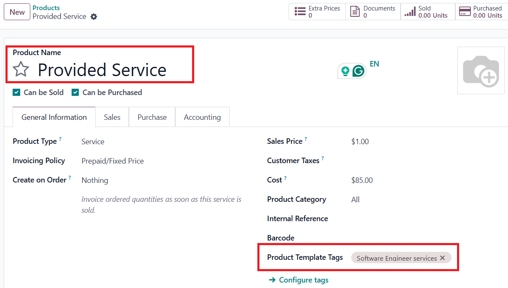
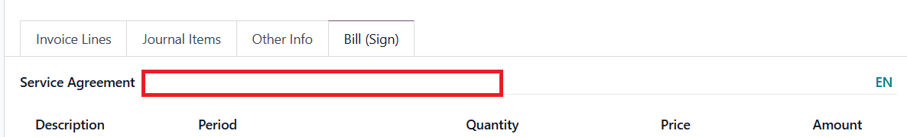

Overview
---------------
This module allows you to build a multi-language PE Invoice report out of a Vendor Bill. The default code covers English/Ukrainian PE Invoice. 
Note: PE Invoice report structure is built following the existing requirements of Ukrainian law. 

Features
---------------
- PE Invoice PDF report in Vendor Bill.
- Company specific Terms and Conditions in PE Invoice report.
- Correlate Product in PE Invoice to follow PE permitted type(s) of activities.
- Translate fields in Res.Partner: Name, Street (1,2), City. 

How to work
---------------
1. Set up Vendor Contact:
   - fill in Name;
   - fill in the Address info;
   - add Email;
   - add Bank account; 
   - set Vendor Language, where English language would lead to a mono language PE Invoice report in English; and Ukrainian language would         provide a multi-language English-Ukraine report;
   - if Ukrainian language is set, make sure to add a translation of the following values: Name, Street (1,2), State (if any), City.
2. Set up Company Contact:
 - fill in Name;
 - fill in the Address info;
 - add Email;
 - If a multi-language PE Invoice report is supposed to be built, make sure to add a translation of the following values: Name, Street (1,2), State (if any), City;
 - add a translation of the mentioned values in English (if absent).
3. Add specific Terms and Conditions to propagate in PE Invoice report (if any): go to Bill Info section in res.company.. Add a translation of
   the added information..
4. Set up Vendor Product:
 
 - if Product in Vendor Bill doesn't correlate with a permitted activity type supposed to be included in PE Invoice, configure and add a           corresponding Product Template tag. Add Product Template tag translation.

 Example: 
Note: Product in PE Invoice is computed based on Product set in the first line in the Vendor Bill.
5. Add Service Agreement reference in the Vendor Bill: go to Bill (Sign) tab In the Vendor Bill and set the value in Service Agreement field.      Add a translation (if needed). 

6. Confirm Vendor Bill for the system to compute the data to propagate in PE Invoice report. Print report.
 