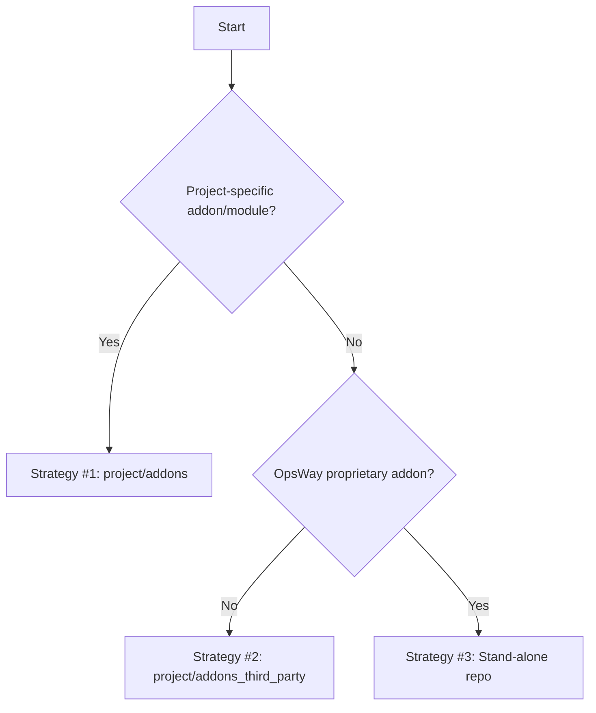

# Odoo Module Installation Guide

## Purpose

This guide defines standardized procedures for incorporating OpsWay proprietary, third-party, or OCA modules into a
project repository. It provides a clear decision-making framework and execution steps to ensure consistency and
maintainability across engineering teams.

**How to use:**

1. Choose appropriate integration strategy, see **Strategy Selection Cheat-Sheet** section.
2. Execute chosen strategy, guided by **Strategy Execution Guides**.

---

## 1. Strategy Selection Cheat-Sheet

Work through the conditions top-down. The first applicable rule determines the strategy.



---

## 3. Strategy Execution Guides

### Strategy #1: Project-Specific Custom Addon

- **Path**: `project/addons/<addon_name>`
- **Action**: Copy or initialize addon source here.
- **Change Management**: All modifications must be made via pull requests and accompanied by tests.

---

### Strategy #2: Third-Party Addons (Project-Scoped, Default)

- **Path**: `project/addons_third_party/<addon_name>`
- **Action**: Copy the addon source here.
- **Change Management**: PRs required for updates or version changes. Include tests.

If addon is paid:

- Add addon source code to appropriate branch of [odoo-modules](https://github.com/opsway/odoo-modules) repository

If addon is free:

- Add addon name and version to
  the [list of free modules](https://github.com/opsway/odoo-modules/blob/master/free_modules.md)

---

### Strategy #3: OpsWay Proprietary Addon (Stand-Alone Repository)

- **Setup**:

    1. Link it as a submodule:
       ```sh
       git submodule add git@github.com:opsway/odoo_<addon_name>.git submodules/odoo_<addon_name>
       git commit -m '[TK-123][ADD] proprietary <addon_name>'
       ```

- **CI Setup (e.g., GitHub Actions)**:

  Note: make sure to replace all placeholders in angle brackets with correct values.

    - Add secret to repository with deployment private key, name it `DEPLOY_KEY_<submodule_name>`
    - In "Get submodules" step `env` section add:
      ```sh
      DEPLOY_KEY_<submodule_name>: ${{secrets.DEPLOY_KEY_<submodule_name>}}
      ```
    - In "Get submodules" step `run` section add:
      ```sh
      echo "DEPLOY_KEY_<submodule_name>" > $HOME/.ssh/id_rsa
      chmod 600 $HOME/.ssh/id_rsa
      git submodule update --init --recursive -- submodules/<submodule_path>
      ```

- **Odoo Configuration**:

  Update odoo.conf files (there may be several), replace placeholder in angle brackets with correct value:
  ```ini
  addons_path = /mnt/extra-addons,...,/mnt/submodules/<submodule_path>
  ```
